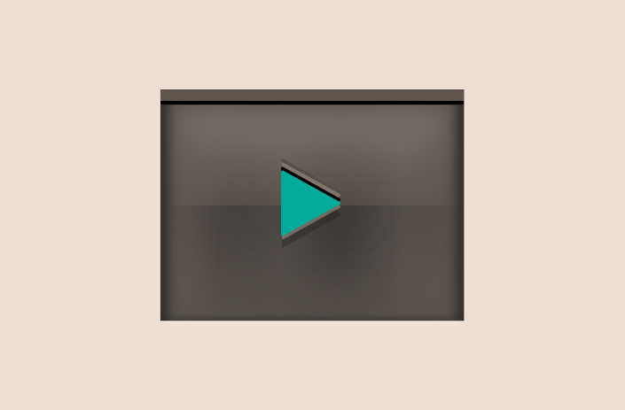

# stylus-skeuomorphic
<br>
skeuomorphic UI parts generated by stylus.

## Quick Start

### Installation


```shell
$ npm i stylus sylus-skeuomorphic
```

### Usage

1. make config or use presets with `skeu-config` function.  
  ```stylus
  config = {
    name: 'gray',
    material: {
      duration: 100ms,
      texture: {
        type: 'flare',
        times: 5,
        opacity: 0.2
      },
      bg_color: white,
      vignette_effect: 0.1,
      diffusion: 0.1,
      top: {
        blend: 0.25,
        alpha: 0.8
      },
      bottom: {
        blend: 0.15,
        alpha: 0.5
      }
    },
    normal: {
      theme_color: #aaa,
      lightness_mod: -25,
      saturation_mod: 0,
      spin_mod: 0deg,
      txt_color: white
    },
    hover: {
      theme_color: #999,
      lightness_mod: -37,
      saturation_mod: 0,
      spin_mod: 0deg,
      txt_color: #222
    },
    active: {
      theme_color: #888,
      lightness_mod: -40,
      saturation_mod: 0,
      spin_mod: 0deg,
      txt_color: #222
    }
  }
  ```
  or
  ```
  config = skeu-config('gray')
  ```
  preset types in `'gray' | 'pink' | 'purple' | 'yellow' | 'green' | 'blue' | 'red'`.


2. edit `main.styl` as following.<br>
    ```stylus
    @import 'stylus-skeuomorphic'

    // config as the previous section.
    //
    // config = ...

    stylus-skeuomorphic(config)

    isolate-all = skeu-gray.isolate-all
    .my-class
      { isolate-all }

    // this meaning is same as following...
    // isolate-normal = skeu-gray.isolate.normal
    // isolate-hover  = skeu-gray.isolate.hover
    // isolate-active = skeu-gray.isolate.active
    // .my-class
    //   { isolate-normal }
    //   &:hover
    //     { isolate-hover }
    //   &:active
    //     { isolate-active }

    // more styles...
    .my-class
      size 200px 50px
      text-align center
      font 'sans-serif'
    ```

### Compile

compile `main.styl` file.

```shell
$(npm bin)/stylus -u stylus-skeuomorphic main.styl
# if stylus installed with global
stylus -u stylus-skeuomorphic main.styl
```

### Draw normal state

- __`isolate-normal = skeu-{name}.isolate.normal`__<br>
    

- __`chain-normal = skeu-{name}.chain.normal`__<br>
    as chainable both sides.<br>
    

- __`chain-left-normal = skeu-{name}.chain-left.normal`__<br>
    as chinable only left side.<br>
    

- __`chain-right-normal = skeu-{name}.chain-right.normal`__<br>
    as chinable only right side.<br>
    


### Draw hover state

- __`isolate-hover = skeu-{name}.isolate.hover`__<br>

- __`chain-hover = skeu-{name}.chain.hover`__<br>
    as chinable both sides.<br>

- __`chain-left-hover = skeu-{name}.chain-left.hover`__<br>
    as chinable only left side.<br>

- __`chain-right-hover = skeu-{name}.chain-right.hover`__<br>
    as chinable only right side.<br>

### Draw active state

- __`isolate-active = skeu-{name}.isolate.active`__<br>
  __`chain-active = skeu-{name}.chain.active`__<br>
  __`chain-left-active = skeu-{name}.chain-left.active`__<br>
  __`chain-right-active = skeu-{name}.chain-right.active`__<br>
    


## Config

### `name`

define variable as `skeu-{name}` in global.
```stylus
preset = skeu-config('pink')
override = {
  name: 'foobar'
}
config = merge(preset, override)

stylus-skeuomorphic(config)

isolate-all = skeu-foobar.isolate-all
.my-class
  { isolate-all }
```

### `material`

```stylus
preset = skeu-config('pink')
override = {
  material: {
    duration: 100ms,
    texture: {
      type: 'flare',
      times: 5,
      opacity: 0.2
    },
    bg_color: white,
    vignette_effect: 0.1,
    diffusion: 0.1,
    shadow_length: 0px,
    active_depth: 1px,
    top: {
      blend: 0.25,
      alpha: 0.8
    },
    bottom: {
      blend: 0.15,
      alpha: 0.5
    }
  }
}
config = merge(preset, override)
stylus-skeuomorphic(config)
```

### `normal`, `hover`, `active`

```stylus
preset = skeu-config('pink')
override = {
  normal: { // hover, active has same attributes.
    theme_color: #9f9791,
    lightness_mod: -38,
    saturation_mod: -0,
    spin_mod: -5deg,
    txt_color: #eee
  }
}
config = merge(preset, override)
stylus-skeuomorphic(config)
```

### Functions

#### `circle()`<br>
add `border-radius: 50%` CSS style.<br>


### Theme Editing

#### Color Definition<br>
you should define 5 variables.

+ __`theme_color`__<br>
    all colors will be generated this color to the original.
+ __`lightness_mod`__<br>
    set the amount to modulate lightness.<br>
    normally, set this value darker.
+ __`saturation_mod`__<br>
    set the amount to modulate saturation.
+ __`spin_mod`__<br>
    set the amount to spin hue.<br>
    you should use 'deg' unit.
+ __`txt_color`__<br>
    set the text color.

#### Material Definition<br>

+ __`duration`__<br>
    set the duration of CSS transition from a state to another.
+ __`texture`__<br>
    - __`type`__<br>
        set the type of texture.
        * __`'image'`__<br>
            
        * __`'flare'`__<br>
        * __`'v_stripe'`__<br>
        * __`'v_stripe_abs'`__<br>
        * __`'h_stripe'`__<br>
        * __`'h_stripe_abs'`__<br>
        * __`'tl_stripe'`__<br>
        * __`'tl_stripe_abs'`__<br>
            
        * __`'tr_stripe'`__<br>
        * __`'tr_stripe_abs'`__<br>
    - __`src`__<br>
        source URL of image.<br>
        used in `image`.
    - __`size`__<br>
        set width and height of image (e.g. `'300px 300px'`).<br>
        used in `image`.
    - __`times`__<br>
        set repeat times (e.g. `5`).<br>
        used in `flare | v_stripe | v_stripe_abs | h_stripe | h_stripe_abs | tl_stripe | tl_stripe_abs | tr_stripe | tr_stripe_abs`.
    - __`opacity`__<br>
        opacity of texture(e.g. `.2`).<br>
        used in `flare | v_stripe | v_stripe_abs | h_stripe | h_stripe_abs | tl_stripe | tl_stripe_abs | tr_stripe | tr_stripe_abs`.
+ __`bg_color`__<br>
+ __`vignette_effect`__<br>
    opacity of vignette effect (e.g. `.9`).<br>
    
+ __`diffusion`__<br>
    opacity of white light diffusion (e.g. `.8`).<br>
    
+ __`shadow_length`__<br>
+ __`active_depth`__<br>
+ __`top`__<br>
    * __`blend`__<br>
        the amount of white light on top side in reflection.
    * __`alpha`__<br>
        hiding power to hide the background on top side in reflection.
+ __`bottom`__<br>
    * __`blend`__<br>
        the amount of white light on bottom side in reflection.
    * __`alpha`__<br>
        hiding power to hide the background on bottom side in reflection.

### import theme
making theme in JSON format as following.

```json
{
  "name": "'blue'",
  "material": {
    "duration": "100ms",
    "texture": {
      "type": "'tl_stripe'",
      "times": 9,
      "opacity": 0.2
    },
    "bg_color": "#33aadd",
    "vignette_effect": 0.3,
    "diffusion": 0,
    "top": {
      "blend": 0.18,
      "alpha": 0.8
    },
    "bottom": {
      "blend": 0.18,
      "alpha": 0.5
    }
  },
  "normal": {
    "theme_color": "#33aadd",
    "lightness_mod": -48,
    "saturation_mod": -60,
    "spin_mod": "0deg",
    "txt_color": "#c33"
  },
  "hover": {
    "theme_color": "#33aadd",
    "lightness_mod": -48,
    "saturation_mod": -60,
    "spin_mod": "0deg",
    "txt_color": "#f33"
  },
  "active": {
    "theme_color": "#33aadd",
    "lightness_mod": -48,
    "saturation_mod": -60,
    "spin_mod": "0deg",
    "txt_color": "#077"
  }
}
```
and use `json()` function.
```stylus
config = json('path/to/theme/blue.json', { hash: true })
```
