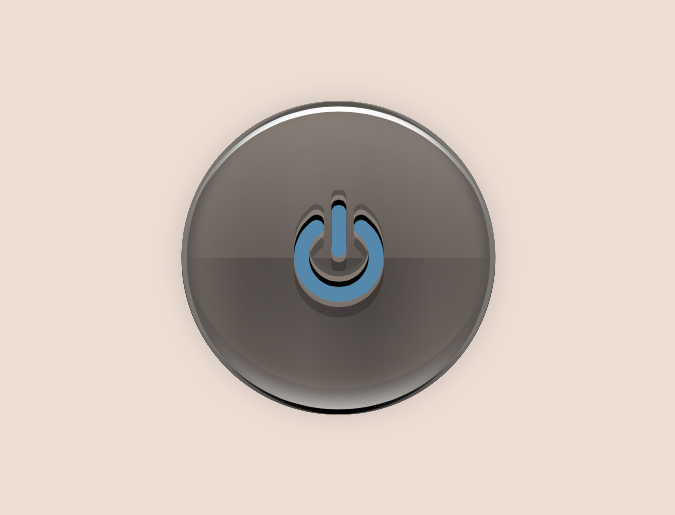

# stylus-skeuomorphic
<br>
skeuomorphic UI parts generated by stylus.

## quick start

### before installation

stylus-skeuomorphic require __Node.js__ and __Gulp__.

[__Node.js: nodejs.org__](https://nodejs.org)

install Node.js. then install Gulp with npm.

```shell
npm install -g gulp
```

### install

1. clone repository.
    ```shell
    git clone https://github.com/all-user/stylus-skeuomorphic.git
    ```

2. go into the directory.
    ```shell
    cd stylus-skeuomorphic
    ```

3. install npm packages.
    ```shell
    npm install
    ```

### edit

edit `index.html` and `main.styl`.

1. make new directory in `./examples`.
    ```shell
    cd examples
    mkdir my_example
    ```

2. make `index.html` and `main.styl`.
    ```shell
    cd my_example
    touch index.html main.styl
    ```

3. edit `index.html` as follows.
    ```html
    <!doctype html>
    <html>
    <head>
        <meta charset="UTF-8">
        <link rel="stylesheet" href="main.css">
    </head>
    <body>
        <div class="my-class">hello world!</div>
    </body>
    </html>
    ```

4. edit `main.styl` as follows.
    ```stylus
    @import '../import_theme/gray.styl'
    @import '../../stylus/skeu.styl'

    body
      bg_color()
      margin 20%

    .my-class
      @extend $gray_skeu
      padding .5em
      font-size 50px
      font-family sans-serif
      &:hover
        @extend $gray_skeu_hover
      &:active
        @extend $gray_skeu_active
    ```

### compile

compile `main.styl` files in `./examples/**`.

```shell
gulp stylus
```

preview `index.html`.

```shell
open index.html
```

## API

these are stylus objects in stylus-skeuomorphic.<br>
you can use these objects in your project.

```stylus
@import 'stylus-skeuomorphic/stylus/skeu.styl'
```

### Placeholder

use __`@extend`__ keyword to use placeholder.<br>
__`(pre)`__ is replaced name of the theme file.

```stylus
@import 'stylus-skeuomorphic/examples/import_theme/gray.styl'
@import 'stylus-skeuomorphic/stylus/skeu.styl'

.my-class
  @extend $gray_skeu
```

+ draw __`$usual`__ placeholders

    - __`$(pre)_skeu`__<br>
        draw UI defined by __`$usual`__.<br>
        

    - __`$(pre)_skeu_chain`__<br>
        as chinable both sides.<br>
        

    - __`$(pre)_skeu_chain_l`__<br>
        as chinable only left side.<br>
        

    - __`$(pre)_skeu_chain_r`__<br>
        as chinable only right side.<br>
        


+ draw __`$hover`__ placeholders

    - __`$(pre)_skeu_hover`__<br>
        draw UI defined by __`$hover`__.<br>

    - __`$(pre)_skeu_chain_hover`__<br>
        as chinable both sides.<br>

    - __`$(pre)_skeu_chain_l_hover`__<br>
        as chinable only left side.<br>

    - __`$(pre)_skeu_chain_r_hover`__<br>
        as chinable only right side.<br>

+ draw __`$active`__ placeholder

    - __`$(pre)_skeu_active`__<br>
        draw UI defined by __`$active`__.<br>
        

### Functions

+ __`bg_color()`__<br>
    draw color defined by __`$bg_color`__ to `background` .<br>
    stylus<br>
    ```stylus
    body
      bg_color()
    ```
    css<br>
    ```css
    body {
        background: #edded4;
    }
    ```


+ __`circle()`__<br>
    add `border-radius: 50%` CSS style.<br>
    

### variables

+ __`$material`__<br>
    assign the path of material defining file.<br>
    this is loaded in `skeu.styl`.
+ __`$usual`__<br>
    assign the path of usual color defining file.<br>
    this is loaded in `skeu.styl`.
+ __`$hover`__<br>
    assign the path of hover color defining file.<br>
    this is loaded in `skeu.styl`.
+ __`$active`__<br>
    assign the path of active color defining file.<br>
    this is loaded in `skeu.styl`.
+ __`$shadow_length`__<br>
    length of shadow on bottom side.
+ __`$active_depth`__<br>
    depth of depressed button when using `$(pre)_skeu_active` placeholder.

### Theme Editing

theme consists of two types of `.styl` files.<br>
one defines color, ohter defines material.

- __color defining__<br>
    you should define 5 variables.
    ```stylus
    // theme color
    $theme_color = #a9a19c

    // modulation config
    $lightness_mod  = -38
    $saturation_mod = 0
    $spin_mod       = -5deg

    // text color
    $txt_color = #eee
    ```
    + __`$theme_color`__<br>
        all colors will be generated this color to the original.
    + __`$lightness_mod`__<br>
        set the amount to modulate lightness.<br>
        normally, set this value darker.
    + __`$saturation_mod`__<br>
        set the amount to modulate saturation.
    + __`$spin_mod`__<br>
        set the amount to spin hue.<br>
        you should use 'deg' unit.
    + __`$txt_color`__<br>
        set the text color.

- __material defining__<br>
    `$duration`, `$texture`, `$texture_param`, `$texture_opacity`, `$bg_color` are optional.
    ```stylus
    $duration ?= 100ms
    $texture = 'flare'
    $texture_param = 5
    $texture_opacity = .3

    // outer background color
    $bg_color = #edded4

    // $vignette_effect: 0..1
    $vignette_effect = .3

    // $diffusion: 0..1
    $diffusion = .1

    // top_reflection
    $top_blend = .25
    $top_alpha = .8
    $bottom_blend = .18
    $bottom_alpha = .5
    ```
    + __`$duration`__<br>
        set the duration of CSS transition from a state to another.
    + __`$texture`__<br>
        set the type of texture.
        * __`'image'`__<br>
            paramator: string - image url (e.g. `$texture_param = '../../images/stone.png'`).<br>
            
        * __`'flare'`__<br>
            paramator: integer - repeated times of horizontal directional changing.
        * __`'v_stripe'`__<br>
            paramator: integer - number of stripes.
        * __`'v_stripe_abs'`__<br>
            paramator: integer - number of pixels of stripe width.
        * __`'h_stripe'`__<br>
            paramator: integer - number of stripes.
        * __`'h_stripe_abs'`__<br>
            paramator: integer - number of pixels of stripe width.
        * __`'tl_stripe'`__<br>
            paramator: integer - number of stripes.
        * __`'tl_stripe_abs'`__<br>
            paramator: integer - number of pixels of stripe width. (e.g. `$texture_param = 2`)<br>
            
        * __`'tr_stripe'`__<br>
            paramator: integer - number of stripes.
        * __`'tr_stripe_abs'`__<br>
            paramator: integer - number of pixels of stripe width.
    + __`$texture_param`__<br>
        paramator for `$texture`.<br>
        this depends on the type of `$texture`.
    + __`$texture_opacity`__<br>
        opacity of texture.<br>
        can not use when `$texute = 'image'`.
    + __`$image_size`__<br>
        set width and height of image (e.g. `$image_size = '300px 300px'`).<br>
        you can set when `$texute = 'image'`.
    + __`$bg_color`__<br>
        this color is used with `bg_color()` function.
    + __`$vignette_effect`__<br>
        opacity of vignette effect (e.g. `$vignette_effect = .9`).<br>
        
    + __`$diffusion`__<br>
        opacity of white light diffusion (e.g. `$diffusion = .8`).<br>
        
    + top light reflection
        * __`$top_blend`__<br>
            the amount of white light on top side in reflection.
        * __`$top_alpha`__<br>
            hiding power to hide the background on top side in reflection.
        * __`$bottom_blend`__<br>
            the amount of white light on bottom side in reflection.
        * __`$bottom_alpha`__<br>
            hiding power to hide the background on bottom side in reflection.

### import theme
assign the path to file into `$material`, `$usual`, `$hover` and `$active`, then import `skeu.styl`.
```stylus
$theme_prefix = 'gray'

$material = '../../stylus/theme/gray/gray_material.styl'
$usual = '../../stylus/theme/gray/gray.styl'
$hover = '../../stylus/theme/gray/gray_hover.styl'
$active = '../../stylus/theme/gray/gray_active.styl'

@import '../../stylus/skeu.styl'
```

or, you can create an import file, and read it.

`import_gray.styl`
```stylus
$theme_prefix = 'gray'
$material = '../../stylus/theme/gray/gray_material.styl'
$usual = '../../stylus/theme/gray/gray.styl'
$hover = '../../stylus/theme/gray/gray_hover.styl'
$active = '../../stylus/theme/gray/gray_active.styl'
```
`main.styl`
```stylus
@import './import_gray.styl'
@import '../../stylus/skeu.styl'
```

## import multiple themes
import another theme that you want and `skeu.styl` with using `@import` keyword.


```stylus
@import '../import_theme/gray.styl'
@import '../../stylus/skeu.styl'

// import another theme...
@import '../import_theme/pink.styl'
@import '../../stylus/skeu.styl'

.gray_button
  @extend gray_skeu
  &:hover
    @extend gray_skeu_hover
  &:active
    @extend gray_skeu_active

.pink_button
  @extend pink_skeu
  &:hover
    @extend pink_skeu_hover
  &:active
    @extend pink_skeu_active
```
